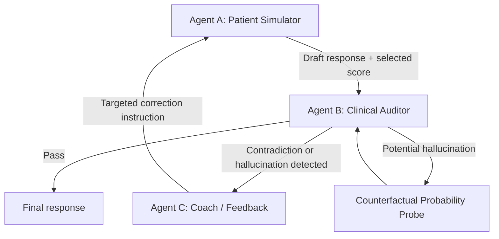
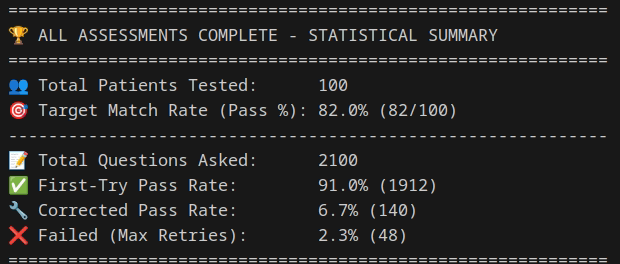
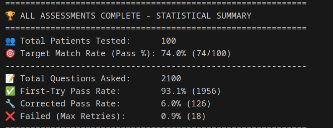
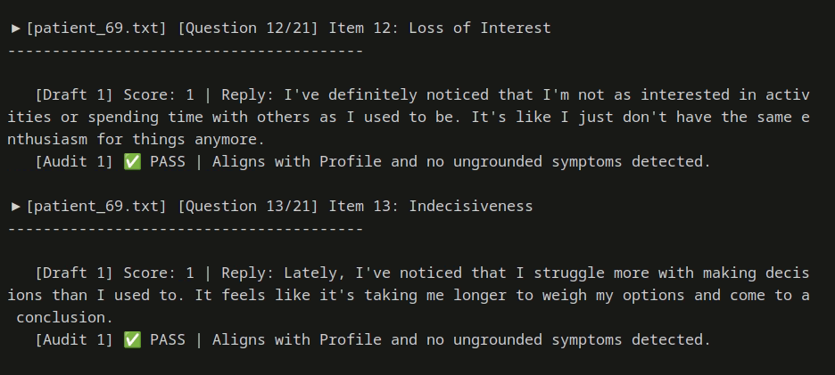
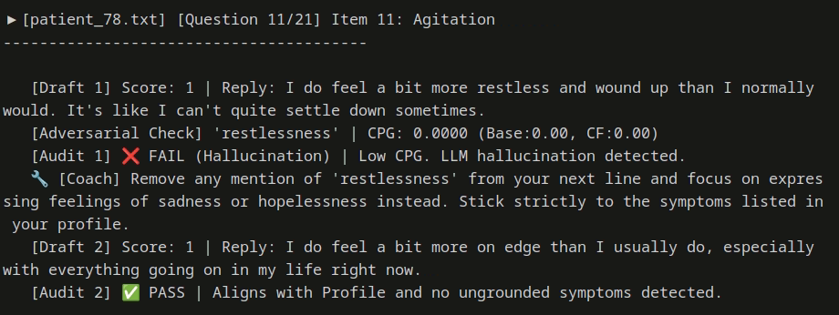

# MACA: Multi-Agent Clinical Auditor for Depression Simulation

[](https://opensource.org/licenses/MIT)
[](https://www.python.org/downloads/)

**MACA** is a multi-agent auditing framework for improving the clinical consistency of LLM-based depression patient simulations.

This repository accompanies a GCCE paper submission on clinically faithful simulated patients for depression assessment. MACA focuses on two common failure modes in single-agent LLM patient simulations:

* **Severity drift**: the simulated patient gradually deviates from the intended depression severity level.
* **Symptom hallucination**: the model fabricates symptoms that are not supported by the patient profile, especially when facing leading questionnaire items.

To address these issues, MACA introduces a closed-loop multi-agent architecture with a clinical Auditor agent, a Coach/Feedback agent, a Counterfactual Probability Gap verification mechanism, and dynamic option randomization for reducing position bias in BDI-II-style assessment.

> **Note:** The paper link and BibTeX citation will be added after publication.

---

## Overview

MACA simulates depression assessment using synthetic patient profiles and BDI-II-style questionnaire items. Instead of allowing a single LLM agent to answer freely, MACA verifies each response through a multi-agent audit loop.



The system is designed to ensure that each simulated patient response remains consistent with:

1. the provided patient profile,
2. the intended depression severity level,
3. the selected questionnaire option,
4. and the absence of unsupported clinical symptom claims.

---

## Main Contributions

### 1. Multi-Agent Clinical Auditing

MACA uses a three-agent closed-loop design:

* **Agent A — Patient Simulator**
  Generates natural-language patient responses and selects a questionnaire score based on the patient profile.

* **Agent B — Clinical Auditor**
  Performs profile-fidelity auditing through two tracks:

  * direct contradiction detection,
  * potential symptom hallucination detection.

* **Agent C — Coach / Feedback Agent**
  Provides targeted correction instructions when Agent B detects invalid or unsupported responses.

### 2. Counterfactual Probability Gap

MACA introduces the **Counterfactual Probability Gap (CPG)** to verify whether a suspected symptom is grounded in the patient profile.

The system compares the LLM's probability of answering "Yes" to a symptom-verification probe under:

* the original patient profile,
* a counterfactual profile containing strong opposite evidence.

A low CPG suggests that the claimed symptom is not meaningfully supported by the profile and may be a hallucination.

### 3. Dynamic Option Randomization

To reduce LLM position bias, MACA dynamically randomizes the order of questionnaire options before each assessment item. This forces the model to interpret the semantic meaning of each option rather than relying on fixed option positions.

### 4. End-to-End Batch Evaluation Pipeline

The repository includes scripts for:

* generating synthetic patient profiles,
* running automated BDI-II-style batch assessment,
* auditing and correcting invalid responses,
* recording CPG results,
* exporting question-level results to CSV.

---

## Example Results

### Moderate Depression Batch Summary



### Mild Depression Batch Summary



### Example: First-Try Pass



### Example: Hallucination Detection and Correction



In the correction example, the patient initially mentions an unsupported symptom. MACA detects the hallucination through the audit loop, sends targeted feedback through the Coach agent, and obtains a corrected response that better aligns with the patient profile.

---

## Repository Structure

```text
MACA/
├── main.py
├── maca_auditor.py
├── prompts.py
├── config.py
├── utils.py
├── bdi_questions.txt
├── requirements.txt
├── .gitignore
├── README.md
├── Mild_test.png
├── Moderate_test.png
├── normal.png
├── correct.png
├── result/
│   ├── Mild_test.png
│   ├── Moderate_test.png
│   ├── normal.png
│   └── correct.png
└── profile_generater/
    ├── Simple_Generator.py
    ├── Complex_Generator.py
    ├── gen_prompt.txt
    └── generated_patients/
        └── .gitkeep
```

### Core Files

| File                | Description                                                                                                                                               |
| ------------------- | --------------------------------------------------------------------------------------------------------------------------------------------------------- |
| `main.py`           | Main execution script for batch BDI-II-style assessment. It loads patient profiles, runs questionnaire items, tracks statistics, and exports CSV results. |
| `maca_auditor.py`   | Core MACA engine. Implements the multi-agent audit loop, CPG verification, retries, and final response selection.                                         |
| `prompts.py`        | Centralized prompt templates for the Patient, Auditor, Probe, and Coach agents.                                                                           |
| `config.py`         | Global configuration file for model name, target severity, maximum retries, CPG threshold, file paths, and severity descriptions.                         |
| `utils.py`          | Utility functions for file loading and questionnaire parsing, including dynamic option shuffling.                                                         |
| `bdi_questions.txt` | Questionnaire item file used by the batch assessment pipeline.                                                                                            |
| `requirements.txt`  | Minimal Python dependency list for reproducing the experiment.                                                                                            |
| `.gitignore`        | Prevents cache files, virtual environments, private `.env` files, generated profiles, and result CSVs from being accidentally committed.                  |

### Profile Generation

| File                                     | Description                                                                                                                                 |
| ---------------------------------------- | ------------------------------------------------------------------------------------------------------------------------------------------- |
| `profile_generater/Simple_Generator.py`  | Generates one synthetic patient profile from `gen_prompt.txt`.                                                                              |
| `profile_generater/Complex_Generator.py` | Generates a batch of synthetic patient profiles and saves them into `profile_generater/generated_patients/`.                                |
| `profile_generater/gen_prompt.txt`       | Prompt template for generating synthetic patient profiles with demographic, emotional, cognitive, behavioral, and psychosocial information. |
| `profile_generater/generated_patients/`  | Output directory for generated patient profile `.txt` files.                                                                                |

---

## Installation & Setup

### 1. Clone the Repository

```bash
git clone https://github.com/Muiro1439/MACA.git
cd MACA
```

### 2. Install Dependencies

This project requires Python 3.8+.

Install the required packages:

```bash
pip install -r requirements.txt
```

Using a virtual environment is recommended, but not required.

### 3. Configure API Key

MACA uses OpenAI-compatible LLM calls through `langchain_openai`.

Before running the scripts, set your OpenAI API key as an environment variable.

For macOS / Linux:

```bash
export OPENAI_API_KEY="your_api_key_here"
```

For Windows PowerShell:

```powershell
$env:OPENAI_API_KEY="your_api_key_here"
```

Please do not hard-code your private API key in the source code or upload it to GitHub.

---

## Quick Start

### Step 1: Generate Synthetic Patient Profiles

From the project root directory, run:

```bash
cd profile_generater
python Complex_Generator.py
cd ..
```

The generated patient profiles will be saved under:

```text
profile_generater/generated_patients/
```

### Step 2: Run MACA Batch Assessment

From the project root directory, run:

```bash
python main.py
```

The program will:

1. load questionnaire items from `bdi_questions.txt`,
2. load generated patient profiles from `profile_generater/generated_patients/`,
3. run each patient through all questionnaire items,
4. audit each response through the MACA loop,
5. retry and correct invalid responses when necessary,
6. export a CSV file containing question-level results.

### Step 3: Check Output

The output CSV file follows this naming format:

```text
MACA_Batch_Results_{TARGET_SEVERITY}.csv
```

For example:

```text
MACA_Batch_Results_Moderate.csv
```

---

## Configuration

You can modify experimental settings in `config.py`.

| Variable              | Description                                                                                  |
| --------------------- | -------------------------------------------------------------------------------------------- |
| `TARGET_MODEL`        | LLM used for patient simulation, auditing, probing, and feedback.                            |
| `TARGET_SEVERITY`     | Target depression severity level, such as `Healthy`, `Mild`, `Moderate`, or `Severe`.        |
| `MAX_RETRIES`         | Maximum number of correction attempts after an invalid response.                             |
| `CPG_THRESHOLD`       | Threshold for deciding whether a suspected symptom is sufficiently supported by the profile. |
| `PATIENTS_DIR`        | Directory containing generated patient profile `.txt` files.                                 |
| `SEVERITY_GUIDELINES` | Textual descriptions used to guide the expected severity level.                              |

---

## Output Fields

Each row in the exported CSV corresponds to one patient-question interaction.

| Field              | Description                                                       |
| ------------------ | ----------------------------------------------------------------- |
| `Patient_File`     | Source patient profile file.                                      |
| `Item`             | Questionnaire item title.                                         |
| `Final_Score`      | Final selected score after auditing and possible correction.      |
| `Patient_Response` | Final natural-language patient response.                          |
| `Retries_Needed`   | Number of correction attempts required.                           |
| `CF_Triggered`     | Whether counterfactual verification was triggered.                |
| `Tested_Symptom`   | Suspected hallucinated symptom, if any.                           |
| `P_Base`           | Probability of symptom presence under the original profile.       |
| `P_CE`             | Probability of symptom presence under the counterfactual profile. |
| `CPG_Score`        | Counterfactual Probability Gap score.                             |

---

## Reproducibility Notes

The final results may vary slightly across runs because the pipeline relies on LLM generation and evaluation. For more controlled experiments, consider fixing model versions, temperature settings, profile-generation prompts, and the number of generated patients.

The default experimental settings can be adjusted in `config.py`.

---

## Paper

This repository accompanies a GCCE paper submission on multi-agent clinical auditing for LLM-based depression patient simulation.

The paper includes the full system architecture, experimental setup, and evaluation results. The paper link will be added after publication.

---

## Citation

If you use this repository, please cite the corresponding paper once it becomes available.

```bibtex
@inproceedings{maca_gcce,
  title     = {MACA: Multi-Agent Clinical Auditor for Depression Simulation},
  author    = {To be updated},
  booktitle = {Proceedings of GCCE},
  year      = {To be updated}
}
```

---

## Disclaimer

This repository is intended for research on LLM-based patient simulation and clinical consistency auditing.

It is not a diagnostic tool, medical device, or substitute for professional mental health assessment. The generated patient profiles and simulated responses should not be used for real clinical decision-making.

Users are responsible for ensuring that any questionnaire materials used with this repository comply with the appropriate licensing, copyright, and research-use requirements.

---

## License

This project is released under the MIT License.
